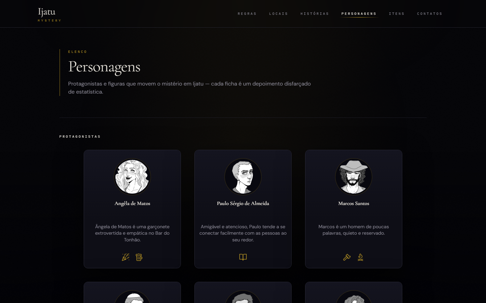
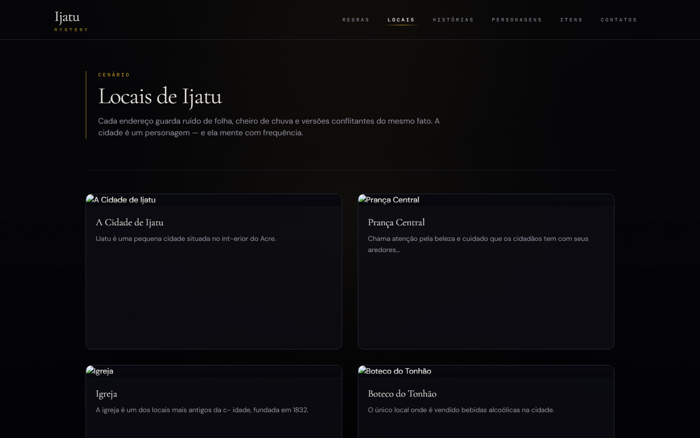
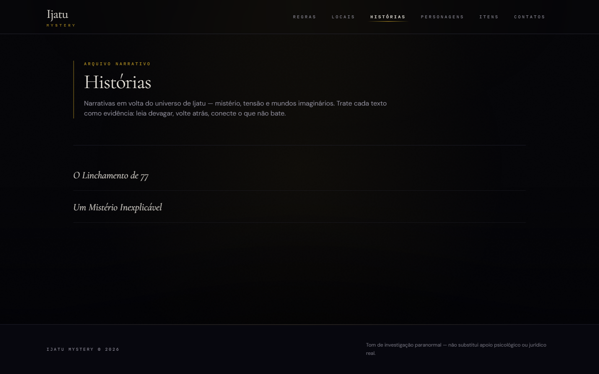

# The Ijatu Mystery RPG

[](https://react.dev/)
[](https://www.typescriptlang.org/)
[](https://vitejs.dev/)
[](https://tailwindcss.com/)
[](https://nodejs.org/)

> Um dossiê web interativo para um RPG de mesa de mistério ambientado em Ijatu — uma cidade quieta do Acre, onde o silêncio guarda os próprios segredos.

**The Ijatu Mystery RPG** é uma aplicação de página única (SPA) em React que apresenta o material de referência da campanha: regras, locais, histórias, personagens e equipamentos. Os visitantes percorrem o arquivo como se fossem pastas de investigação — não se trata de um cliente multiplayer em tempo real, e sim de um site companheiro, atmosférico, para leitura e exploração do cenário.

---

## Prévia

### Início


### Personagens · Locais · Histórias

| Personagens | Locais |
| --- | --- |
|  |  |



---

## Sobre o projeto

Ijatu é apresentada como uma pequena cidade do Acre, de laços estreitos, cuja superfície pacífica é rasgada por assassinato e suspeita. Este site organiza essa ficção em seções navegáveis, para que jogadores e mestres consultem o material entre sessões — ou simplesmente vagueiem pelo dossiê.

**Áreas de conteúdo disponíveis na aplicação:**

- **Início** — introdução cinematográfica, enquadramento do caso e atalhos para o arquivo
- **Regras** — orientação ao mestre, como jogar, sistema de dados, habilidades e combate
- **Locais** — dossiês da cidade e das cenas, com mapas e segredos opcionais
- **Histórias** — relatos narrativos curtos do universo
- **Personagens** — protagonistas e NPCs, com diálogos no estilo de ficha
- **Itens** — tabelas de referência de armas e equipamentos, além de notas sobre improviso
- **Contatos** — canal editorial público via GitHub do autor

A interface aposta em uma atmosfera escura e investigativa: camadas de grão e vinheta, transições suaves entre páginas, tipografia monoespaçada com sotaque de “arquivo” e textos em português em toda a experiência.

---

## Funcionalidades

### Implementadas

- Roteamento no cliente entre início, regras, locais, histórias, personagens, itens, contatos e página 404
- Introdução cinematográfica de sessão (`IntroGate`), com opção de pular e dispensa via `sessionStorage`
- Camadas visuais ambientais (grão cinematográfico, vinheta e brilho que segue o cursor) por meio de `CinematicLayers` e `useCursorGlow`
- Rolagem suave com Lenis, sincronizada ao GSAP ScrollTrigger (`useLenis`), com respeito a `prefers-reduced-motion`
- Transições animadas de rota (Framer Motion)
- Navegação responsiva (links no desktop e menu no celular)
- Área de regras com índice lateral fixo em telas grandes e gaveta móvel no celular
- Cards de locais com links para páginas de detalhe (descrição, texto rico, imagem de mapa opcional e lista de segredos)
- Listagem e páginas de detalhe das histórias, alimentadas por objetos TypeScript tipados
- Cards de personagens com diálogos do Radix UI (personalidade, aparência, atributos, habilidades e lore)
- Catálogos de armas e itens em cards no celular e em tabelas no desktop
- Link “pular para o conteúdo” para acessibilidade por teclado
- Configuração de *rewrite* de SPA para a Vercel (`vercel.json`)

### Decisões editoriais e de produção

- Os locais e catálogos usam conteúdo em português revisado, regras completas de distância/condições e preços no formato `cr$`.
- As imagens de locais, mapas, marca e compartilhamento ficam em `public/assets/`, sem dependência de hotlinks.
- A versão do projeto e a política de publicação permanecem sob decisão do mantenedor.
- Dependência não utilizada: `@radix-ui/react-dropdown-menu` (não importada em `src`)
- Alguns arquivos de perfil em `src/assets/ProfilePictures/` e o componente `MysteryouSvg.tsx` não são referenciados pelos dados ou pela interface atuais

---

## Tecnologias

| Tecnologia | Papel neste projeto |
| --- | --- |
| **React 18** | Componentes de interface e composição das páginas |
| **TypeScript** | Tipagem de rotas, modelos de conteúdo e componentes |
| **Vite 5** | Servidor de desenvolvimento e *build* de produção |
| **React Router DOM 6** | Rotas e navegação no cliente |
| **Tailwind CSS** (compatível com PostCSS 7) | Layout, *tokens* de tema e estilos responsivos |
| **Framer Motion** | Transições de página, introdução e animação de listas |
| **GSAP + ScrollTrigger** | Movimento ligado à rolagem na página inicial |
| **Lenis** | Rolagem suave coordenada com o ScrollTrigger |
| **Radix UI Dialog** | Modais acessíveis de detalhe dos personagens |
| **Lucide React** | Ícones nas páginas e nos cards |
| **clsx + tailwind-merge** | Composição de classes (`cn`) |
| **ESLint** | Script de *lint* para TypeScript / React |
| **Vercel** | Configuração de *hosting* e *rewrite* da SPA |

O Node.js **24.x** está declarado em `engines` no `package.json`.

---

## Estrutura do projeto

```text
The-Ijatu-Mystery-Rpg/
├── docs/images/          # Capturas de tela da prévia do README
├── public/               # Ativos públicos estáticos (se houver)
├── src/
│   ├── Pages/            # Telas por rota
│   ├── components/       # Blocos de UI (nav, cards, cinematic, layout)
│   ├── config/           # Links da navegação principal e do índice de regras
│   ├── data/             # Fonte única de conteúdo editorial, em objetos TypeScript tipados
│   ├── hooks/            # Busca de conteúdo, Lenis, brilho do cursor
│   ├── routes/           # Tabela de rotas consumida pelo App
│   ├── types/            # Interfaces TypeScript compartilhadas do conteúdo
│   ├── utils/            # Utilitários de formatação de texto rico
│   ├── assets/           # Fotos de perfil, ícone do site, componentes SVG
│   ├── App.tsx           # Casca: nav, rodapé, transições e camadas cinemáticas
│   └── main.tsx          # Raiz React + BrowserRouter
├── index.html
├── package.json
├── package-lock.json
├── vite.config.ts
├── tailwind.config.js
└── vercel.json
```

O conteúdo é orientado a dados e vive exclusivamente em `src/data/*.ts`: regras, locais, histórias, armas, itens e personagens são objetos TypeScript com IDs e referências cruzadas tipadas. `src/types/content.ts` concentra as interfaces e unions de IDs; os arquivos em `src/data/` usam `satisfies` para validar cada coleção em tempo de compilação.

---

## Rotas

Definidas em `src/routes/appRoutes.tsx`:

| Caminho | Finalidade |
| --- | --- |
| `/` | Início / introdução ao caso |
| `/regras` | Hub de regras (introdução + índice lateral) |
| `/regras/:id` | Artigo individual de regra (`mestre-jogo`, `como-jogar`, `sistema-dados`, `habilidades`, `combate`) |
| `/locais` | Grade de locais |
| `/locais/:id` | Dossiê do local |
| `/historias` | Índice de histórias |
| `/historias/:id` | Artigo de história |
| `/personagens` | Elenco (protagonistas e NPCs) |
| `/itens` | Referência de armas e itens |
| `/contatos` | Página de contatos |
| `*` | Página não encontrada |

Os rótulos da navegação (em português) estão em `src/config/navigation.ts`.

---

## Como começar

### Pré-requisitos

- **Node.js 24.x** (conforme `engines` no `package.json`)
- **npm** (este repositório inclui `package-lock.json`)

### Instalação e execução

```bash
npm install
npm run dev
```

Em seguida, abra o endereço local indicado pelo Vite (em geral, `http://localhost:5173`).

Não há variáveis de ambiente exigidas pelo código atual; o projeto não utiliza `.env`.

---

## Scripts disponíveis

| Script | Comando | Descrição |
| --- | --- | --- |
| Desenvolvimento | `npm run dev` | Inicia o servidor de desenvolvimento do Vite |
| Build | `npm run build` | Verifica tipos com `tsc` e gera o *build* de produção |
| Lint | `npm run lint` | Executa o ESLint em `.ts` / `.tsx`, sem avisos permitidos |
| Prévia | `npm run preview` | Serve localmente o *build* de produção |

---

## Destaques de design e técnica

- **Interface em estilo de dossiê** — paleta Tailwind própria (`void`, `bone`, `signal` etc.) e fontes de display (Cormorant Garamond, DM Sans, IBM Plex Mono) carregadas em `index.html`
- **Cascas de página reutilizáveis** — `PageFrame` para páginas de conteúdo; `RulesPageLayout` para a experiência de regras em dois painéis
- **Modelos de conteúdo tipados** — interfaces compartilhadas em `src/types/content.ts` para regras, locais, histórias, armas e itens
- **Hooks de busca** — `useRuleById`, `useLocalById` e `useLoreById` mantêm as páginas de detalhe enxutas
- **Conteúdo seguro em regras e locais** — os artigos renderizam campos tipados diretamente, sem conversão de JSON em HTML
- **Catálogos responsivos** — itens e armas alternam entre cards em telas pequenas e tabelas a partir de `sm+`
- **Movimento com restrição** — Lenis, GSAP e o brilho do cursor respeitam `prefers-reduced-motion`
- **Hospedagem de SPA** — `vercel.json` redireciona todos os caminhos para `/`, em favor do roteamento no cliente

---

## Direção editorial e assets

As convenções de escrita, o recorte temporal (Acre, 1987), o glossário mecânico, os avisos de conteúdo e a política de autoria estão em [docs/editorial-guide.md](docs/editorial-guide.md). A biblioteca visual de produção fica em `public/assets/`, com manifesto tipado em [src/assets/assetManifest.ts](src/assets/assetManifest.ts); dados de locais referenciam apenas caminhos locais controlados pelo projeto.

## Status do projeto

Este projeto é um arquivo companheiro autoral para mesas de RPG. O site permite navegar por regras, locais, histórias, personagens e itens; a direção editorial e a política de assets estão documentadas em `docs/editorial-guide.md`.

Trate-o como um dossiê em evolução, e não como um produto finalizado.

## Case study e quality gate

O projeto começou como uma SPA visual com conteúdo misturado à apresentação. A renovação separou dados editoriais, componentes e ativos locais, corrigiu a hierarquia semântica e transformou regras, histórias e catálogos em referências navegáveis. O principal risco de produto era revelar spoilers no fluxo de jogadores; por isso o modo Jogador é o padrão, o modo Mestre persiste apenas como preferência local e cada revelação exige confirmação explícita. Essa preferência não é uma barreira de segurança.

As páginas individuais são carregadas sob demanda com `React.lazy`, e a home mantém GSAP/ScrollTrigger isolados. Cada rota atualiza title, description, canonical, Open Graph, Twitter Card e JSON-LD; `public/robots.txt` e `public/sitemap.xml` completam a base de indexação. O layout usa `<main id="main-content">`, foco após navegação, skip link, focus trap no índice móvel, tabelas com caption e alternativas responsivas.

### Verificação local

```bash
npm ci
npm run lint
npm run typecheck
npm test
npm run build
```

O workflow `.github/workflows/ci.yml` executa os mesmos comandos em cada push e pull request. O script de teste empacota os módulos TypeScript reais com esbuild e valida campos obrigatórios, unicidade, paridade do registro de IDs e referências cruzadas; auditorias de Lighthouse, axe e regressão visual devem ser executadas no ambiente de preview antes de publicar.

### Resultados e limites

O bundle inicial foi dividido por rota e o limite de alerta do Vite foi definido em 450 kB por chunk. Métricas finais de Lighthouse/LCP/CLS dependem do domínio, navegador e rede do deploy e permanecem pendentes até uma execução em preview; não são declaradas como validadas neste repositório. Não há publicação externa configurada pelo projeto.

---

## Roteiro

### Concluído (presente no código)

- [x] Experiência da página inicial, com introdução cinematográfica e enquadramento do caso
- [x] Seção de regras, com navegação por barra lateral / gaveta e páginas de artigo
- [x] Listagem de locais e dossiês de detalhe
- [x] Listagem de histórias e páginas de detalhe
- [x] Elenco de personagens, com diálogos de detalhe
- [x] Visões de referência de armas e itens
- [x] Casca responsiva (barra de navegação, rodapé e 404)
- [x] Camadas cinemáticas, transições de rota e rolagem suave
- [x] Capturas de prévia do README em `docs/images/`

### Próximos passos possíveis

- [ ] Exportar derivados AVIF/WebP e tamanhos responsivos para a biblioteca visual
- [ ] Validar visualmente as telas em 390, 768, 1024 e 1440 px
- [ ] Remover ou integrar ativos e a dependência Radix de *dropdown* não utilizados
- [ ] Incluir um arquivo de licença, caso os termos de distribuição devam ser públicos

---

## Como contribuir

1. Abra uma *issue* descrevendo o *bug*, a lacuna de conteúdo ou a ideia.
2. Faça um *fork* do repositório (ou crie uma *branch* a partir da *branch* padrão mais recente).
3. Realize alterações focadas; mantenha os *commits* claros e com escopo delimitado.
4. Execute `npm run lint` e `npm run build` antes de abrir um *pull request*.
5. Envie um PR com um resumo curto do que mudou e de como verificar.

---

## Autor

**KaiD3v**

- Portfólio: [kaidev.com.br](https://kaidev.com.br)
- GitHub: [github.com/KaiD3v](https://github.com/KaiD3v)
- LinkedIn: [linkedin.com/in/kaidev1](https://www.linkedin.com/in/kaidev1/)

---

## Licença

Não há arquivo de licença neste repositório.
